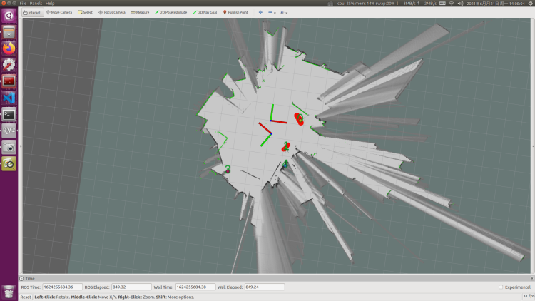

# Robust Triangulation Location

### run
```
$ rosrun cartographer_ros calculate_initial_pose_node

$ rosrun cartographer_ros self_start_calculate_initial_pose_node

$ rosserver call /calculate_initial_pose " "

$ roslaunch landmark_publish landmark_publish.launch
```

### example



### principle


